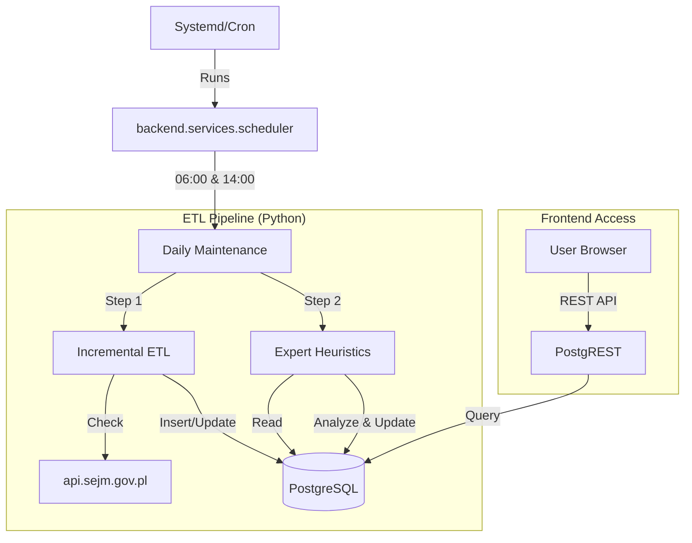

# ETL Workflow & System Architecture

> This document describes how the backend data pipeline works in production (server environment).

---

## 🏗️ System Components



---

## 🕒 Scheduler (Automation)

The system is controlled by `backend/services/scheduler.py`, which uses **APScheduler**.

| Trigger | Time | Action | Description |
|---------|------|--------|-------------|
| **Morning** | `06:00` | `run_daily_maintenance()` | Full sync of yesterday's data |
| **Afternoon** | `14:00` | `run_daily_maintenance()` | Check for ongoing sitting updates |

### Service Definition
The scheduler should run as a systemd service: `backend.services.scheduler`.

---

## 🔄 Daily Workflow Step-by-Step

### 1. Initialization
- **Script**: `backend/services/scheduler.py`
- **Log**: `backend.log` or startup stdout.
- **Action**: Wakes up at scheduled time.

### 2. Incremental ETL (`backend.etl.incremental`)
This is the core sync logic. It respects rate limits and checks for new data only.

1.  **Check Local State**: Reads `.etl_state.json` (or checks DB max sitting).
2.  **Check Sejm API**: Fetches list of all sittings for Term 10.
    *   `GET https://api.sejm.gov.pl/sejm/term10/proceedings`
3.  **Detect New Sittings**: Compares API list vs DB max sitting.
    *   If `API > DB` → Trigger sync for missing sittings.
    *   If `API == DB` → Stop (Nothing to do).
4.  **Sync New Content**:
    *   **MPs**: Downloads new MP list if changed.
    *   **Votes**: `GET /votings/{sitting_num}` and inserts into `votes` table.
5.  **Update State**: Marks sitting as completed in `.etl_state.json`.

### 3. Heuristics Analysis (`backend.etl.heuristics`)
Adds "intelligence" to the raw data.

1.  **Scope**: Selects votes without AI analysis or needing refresh.
2.  **Analysis**:
    *   Matches keywords (e.g., "podatki", "zdrowie").
    *   Generates "Simplest Summary" (TL;DR).
    *   Assigns `importance_score` (0-100).
3.  **Update DB**: Writes JSON blob to `votes.details_json`.

---

## 🛠️ Fail-Safes

- **Idempotency**: All SQL inserts use `ON CONFLICT DO UPDATE/NOTHING`. Re-running the script is safe.
- **Transactions**: Each sitting sync is wrapped in a DB transaction. If it fails, no partial data is saved.
- **Logging**: All actions are logged to `backend/core/logger.py` (stdout/file).

---

## 🚀 Manual Trigger

You can force a run without waiting for the schedule:

```bash
# Run one-off sync immediately
cd /path/to/parlament
source venv/bin/activate
python3 -m backend.etl.incremental
```
